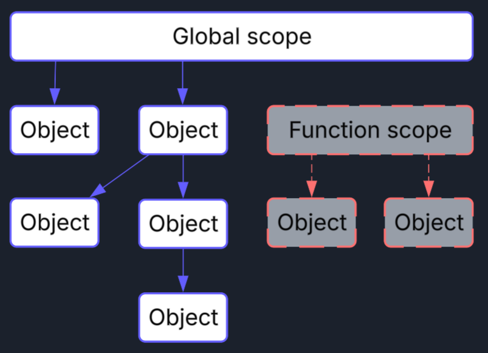

# (JavaScript) Garbage Collection Basics

If you've never programmed in a language that required you to manage your own
memory, you might not appreciate the work that goes into supporting that
freedom.

Even if you do understand the difference, you might not be familiar with how
this sort of thing actually works.

For the first sort: just know that anytime you want to create objects that can
have arbitrary size, or "live" for an arbitrary amount of time, you're probably
stumbling into dynamic memory.

### Dynamic memory

Simply put, primitive values can generally be stored on the call stack. Mostly.
Even objects can sometimes be stored on the stack if their memory footprint is
well constrained. That's great, because memory on the call stack is easy to
clean up--we can just dump it when the current function returns.

Dynamic memory, on the other hand, is messy and unpredictable. You can have as
much memory as you want (within reason), but there's a tradeoff: everything you
ask for, you're responsible for giving back.

If you don't, you'll run out, and the program will crash and burn (loudly).

Enter the garbage collector. It has a simple job: clean up your messes for you.
How does it do this? Simple: pause* your program (at unpredictable intervals),
and look for unused memory. How does it do this? A "mark and sweep" algorithm.

## Mark and Sweep

It's not terribly complicated. First you "mark":

1. Start with every reference at the "top" of the program (or "the global
   scope").
2. Follow every visible reference and "mark" the objects you find (usually
   there's a bit or something reserved for this).
3. Repeat step 3 until you can't find any more references.

Then, you "sweep"

1. Iterate over every object in memory and deallocate them if they're not marked
2. ...that's it!

